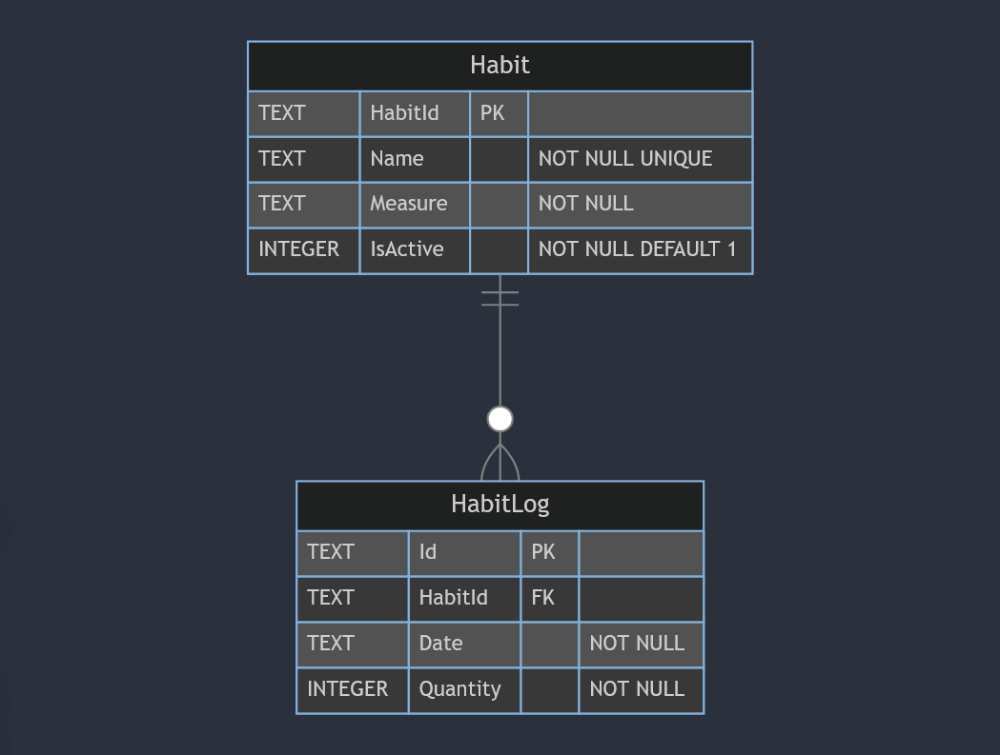

	
	<h1>Habit Tracker</h1>

Welcome to the Habit Tracker App!

This is a .NET project designed to demonstrate working with Razor pages and the simpler file-based routing approach to a web application.

It allows users to manage their habits by creating, viewing, and updating habits and their associated logs. 

The application includes features such as filtering habits based on their status (active or inactive) and sorting habits by different attributes.

## Features

- **Habit Management**:	Create, view and update habits.
- **Habit Logging**: Track progress by logging activities associated with a habit.
- **Filtering**: Filter habits by their status (active/inactive).
- **Sorting**: Sort habits and habit logs by any of the display columns.
- **Responsive Design**: A user-friendly interface designed to work on various devices.

## Technologies

- .NET
- ASP.NET MVC
- ADO.NET
- SQLite
- Bootstrap
- HTML
- CSS
- JavaScript

## Getting Started

### Prerequisites

- .NET 8 SDK installed on your system.
- A code editor like Visual Studio or Visual Studio Code

### Installation

1. Clone the repository:
	- `git clone https://github.com/chrisjamiecarter/habit-tracker.git`

2. Navigate to the project directory:
	- `cd src\habit-tracker\HabitTracker.WebUI`

3. Configure the application:
	- Update the connection string in `appsettings.json` if you want to change the database path that sqlite will use.

4. Build the application using the .NET CLI:
	- `dotnet build`

### Running the Application

1. Run the application using the .NET CLI in the project directory:
	- `dotnet run`

## Usage

Once the application is running, you can:

- Create a new habit by clicking the "Add New Habit" button.
- View habit logs by clicking on the Table icon/button for a specific habit.
- Update habits by clicking on the Edit icon/button for a specific habit.
- Filter and sort habits using the dropdown and column headers.

## How It Works

- **Menu Navigation**: Uses MVC and Razor pages to allow users to navigate the application.
- **Data Storage**: A new sqlite database is created and the required schema is set up at run-time, or an existing database is used if previously created.
- **Data Access**: Interaction with the database is via ADO.NET.

## Database

## Contributing

Contributions are welcome! Please fork the repository and create a pull request with your changes. For major changes, please open an issue first to discuss what you would like to change.

## License

This project is licensed under the MIT License. See the [LICENSE](./LICENSE) file for details.

## Contact

For any questions or feedback, please open an issue.

---
***Happy Habit Tracking!***
